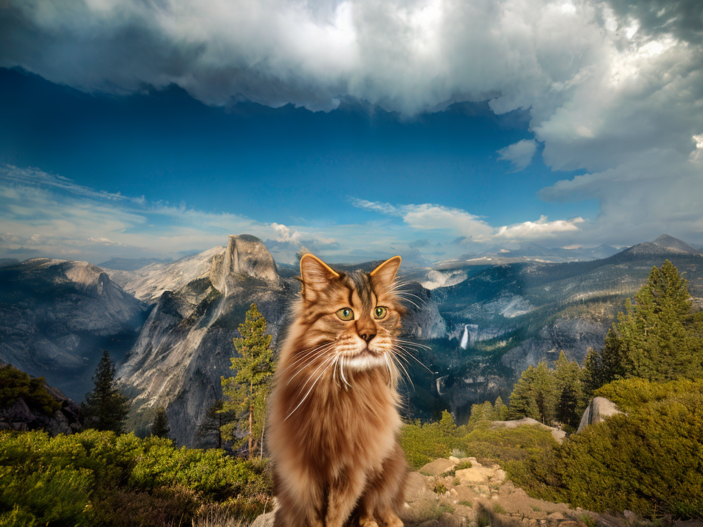
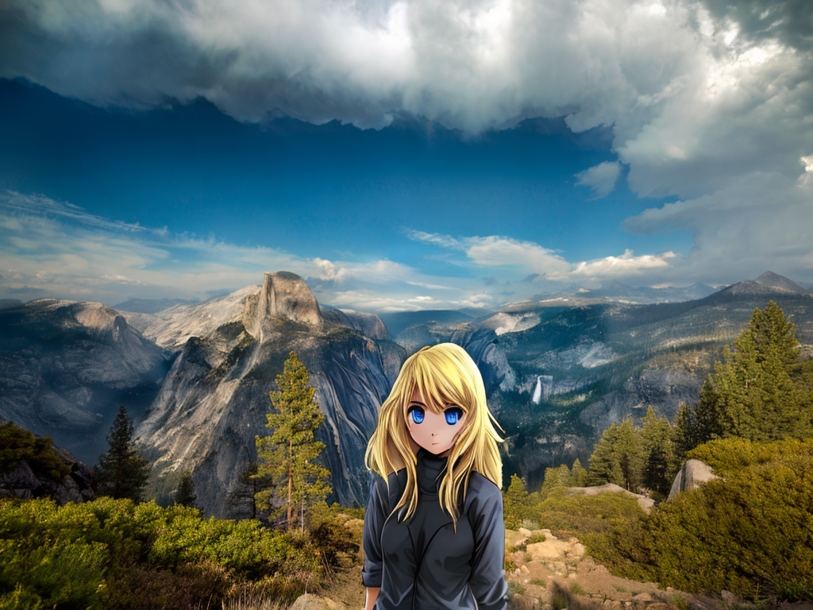
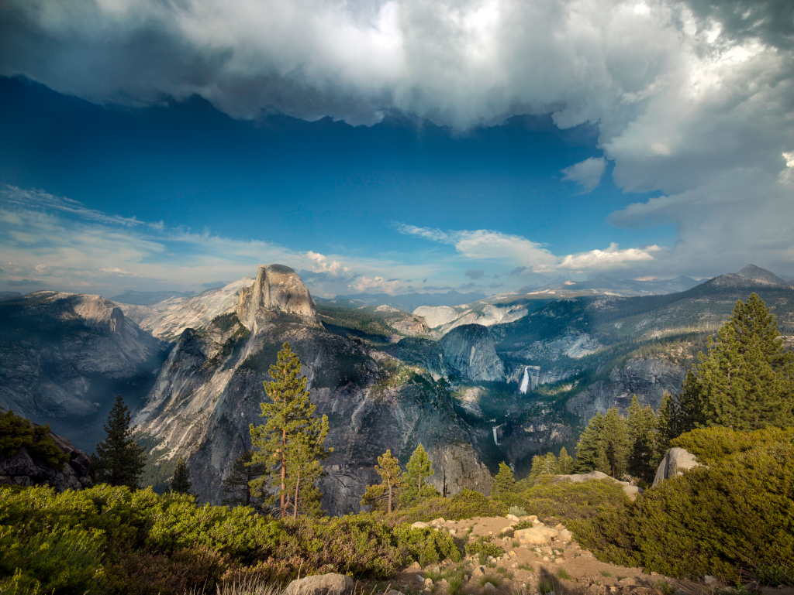

# Inpaint Examples

In this example we will be using this image. Download it and place it in your input folder.

This image has had part of it erased to alpha with gimp, the alpha channel is what we will be using as a mask for the inpainting. If using GIMP make sure you save the values of the transparent pixels for best results.

The following images can be loaded in [ComfyUI](https://github.com/comfyanonymous/ComfyUI) to get the full workflow.

Inpainting a cat with the v2 inpainting model:

Inpainting a woman with the v2 inpainting model:

It also works with non inpainting models. Here's an example with the anythingV3 model:

### Outpainting

You can also use these exact workflows for outpainting, first expand the canvas of the image in your favorite image editor filling it with transparency like in this input image where I expanded the top and bottom:

Using the v2 inpainting model the exact same way as the inpainting examples:

